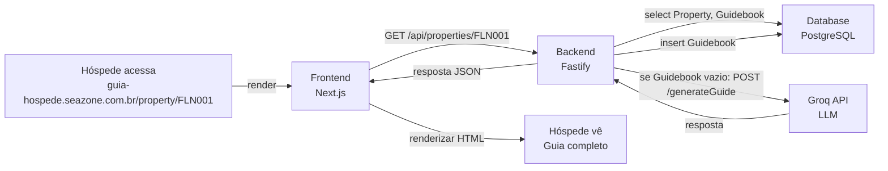
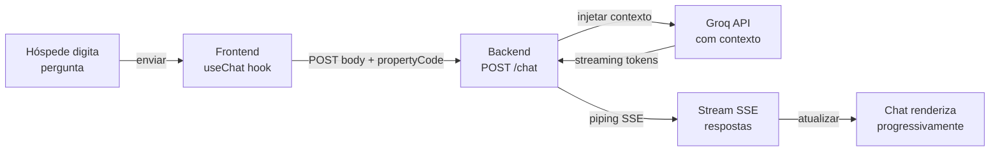

# Visão Geral da Arquitetura

## Estrutura do Monorepo

A solução é organizada como um **monorepo com três serviços principais** (frontend, backend, database) + um quarto serviço de documentação:

```
guia-hospede/
├── frontend/              # Next.js 14 (SSR, API routes proxy)
│   ├── src/
│   │   ├── app/          # App Router
│   │   ├── components/   # Componentes React
│   │   ├── services/     # Chamadas para backend
│   │   └── styles/       # Tailwind CSS
│   └── public/
├── backend/               # Fastify 4 (HTTP server)
│   ├── src/
│   │   ├── routes/       # Endpoints (property, chat, guidebook)
│   │   ├── services/     # Lógica de negócio
│   │   ├── db/           # Prisma schema, migrations
│   │   └── middleware/   # Logging, error handling
│   └── prisma/
├── docs/                  # Mintlify (documentação estática)
│   ├── docs.json         # Configuração
│   └── *.mdx             # Páginas
├── docker-compose.yml    # Orquestração local
└── README.md             # Entrada principal
```

## Serviços Containerizados

Cada serviço é **independente e containerizado**, facilitando deployment no Railway:

### 1. Frontend (Next.js 14)

```dockerfile
# frontend/Dockerfile
FROM node:20-alpine
WORKDIR /app
COPY . .
RUN npm install && npm run build
CMD ["npm", "start"]
ENV NODE_ENV=production
EXPOSE 3000
```

**Responsabilidades**:
- Renderização SSR (Server-Side Rendering) para SEO e performance
- Páginas: `/property/[code]` (guia do imóvel), `/` (home)
- Chamadas ao backend via `GET /api/properties/:code`, `POST /api/chat`
- Chat em tempo real (WebSocket ou streaming SSE)

### 2. Backend (Fastify 4)

```dockerfile
# backend/Dockerfile
FROM node:20-alpine
WORKDIR /app
COPY . .
RUN npm install && npm run build
CMD ["npm", "start"]
ENV NODE_ENV=production
EXPOSE 4000
```

**Responsabilidades**:
- Endpoints REST:
  - `GET /properties/:code` → Dados do imóvel (Property + Guidebook)
  - `POST /properties/:code/guidebook` → Gerar guia por IA
  - `POST /chat` → Chat streaming (SSE)
- Integração com Groq API para IA
- Prisma ORM para banco de dados

### 3. Database (PostgreSQL 16)

```yaml
# docker-compose.yml (local) ou Railway plugin (prod)
postgres:
  image: postgres:16-alpine
  environment:
    POSTGRES_DB: guia_hospede
    POSTGRES_PASSWORD: <secure>
  volumes:
    - postgres_data:/var/lib/postgresql/data
  ports:
    - "5432:5432"
```

**Responsabilidades**:
- Tabelas: `Property`, `Guidebook`, logs de chat
- Volume durável para persistência de dados
- Migrations via Prisma (`prisma migrate`)

### 4. Documentação (Mintlify)

```dockerfile
# docs/Dockerfile
FROM node:20-alpine
WORKDIR /docs
RUN npm install -g mint
COPY . .
CMD ["mint", "dev", "--port", "$PORT", "--host", "0.0.0.0"]
EXPOSE 3000
```

**Responsabilidades**:
- Servidor estático de documentação (Mintlify CLI)
- 15 páginas MDX com arquitetura, features, guias de uso
- Independente dos outros serviços (sem dependência de backend ou db)

## Fluxo de Dados

### Fluxo 1: Hóspede Acessa o Guia de um Imóvel



**Timing**:
- Primeira vez: 2-3 segundos (IA gerando conteúdo)
- Próximas vezes: menos de 500ms (Guidebook em cache no BD)

### Fluxo 2: Hóspede Faz Pergunta no Chat



**Streaming**: Respostas aparecem palavra por palavra, não aguarda conclusão.

## Principais Componentes

### Frontend (React)

```
components/
├── PropertyGuide.tsx       # Layout principal
├── PropertyHeader.tsx      # Fotos, nome, localização
├── PropertyInfo.tsx        # Dados estruturados (acesso, regras, contato)
├── GuidebookSection.tsx    # Restaurantes, atrações, serviços
├── Chat.tsx                # Interface de chat
├── ChatMessage.tsx         # Mensagem individual
└── Skeleton.tsx            # Loading skeleton
```

### Backend (TypeScript + Fastify)

```
services/
├── PropertyService.ts      # Lógica de busca de imóvel
├── GuidebookService.ts     # Geração de conteúdo por IA
├── ChatService.ts          # Processamento de mensagens
└── GroqService.ts          # Integração com Groq API

routes/
├── property.ts             # GET /properties/:code
├── guidebook.ts            # POST /properties/:code/guidebook
└── chat.ts                 # POST /chat (SSE)
```

### Database (Prisma)

```prisma
model Property {
  id       Int       @id @default(autoincrement())
  code     String    @unique
  name     String
  city     String
  state    String
  address  Json
  host     Json
  rules    Json
  // ... mais 20 campos
  guidebook Guidebook?
}

model Guidebook {
  id        Int      @id @default(autoincrement())
  propertyId Int     @unique
  restaurants Json
  attractions Json
  essentials Json
  seasonal  String
  createdAt DateTime @default(now())
}
```

## Fluxo de Deployment

### Local (docker-compose)

```bash
docker-compose up
# ↓
# Frontend em http://localhost:3000
# Backend em http://localhost:4000
# Database em localhost:5432
# Docs em http://localhost:3001
```

### Production (Railway)

1. **Frontend service**
   - Builder: Dockerfile (frontend/)
   - Port: 3000
   - Env: `NEXT_PUBLIC_API_URL=https://backend-service.railway.app`

2. **Backend service**
   - Builder: Dockerfile (backend/)
   - Port: 4000
   - Env: `DATABASE_URL=postgresql://...`, `GROQ_API_KEY=...`

3. **Database service**
   - Plugin: PostgreSQL (Railway)
   - Port: 5432

4. **Docs service**
   - Builder: Dockerfile (docs/)
   - Port: 3000
   - Env: nenhuma obrigatória (estático)

Cada serviço recebe um domínio público do Railway e podem ser escalados independentemente.

---

**Próximo**: Explore o [Stack Tecnológico](/arquitetura/stack) para entender as bibliotecas específicas de cada camada.
