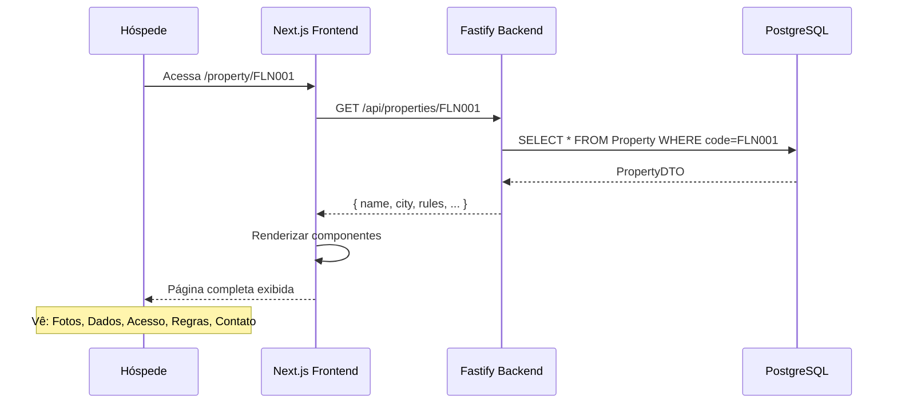

# Requisito Funcional 1 — Visualização do Guia

## Descrição

Quando um hóspede acessa a URL única baseada no código do imóvel (ex: `/property/FLN001`), ele vê de forma clara e organizada todas as informações necessárias para sua estadia.

## O Que o Hóspede Vê

### 1. Dados do Imóvel

```
┌─────────────────────────────────────────────────┐
│  [Fotos do imóvel - slideshow]                  │
│  Apartamento Beira-Mar Florianópolis            │
│  Apartamento | Trindade, Florianópolis/SC      │
│                                                  │
│  👥 Capacidade: 4 hóspedes                      │
│  🛏️  2 quartos | 1 banheiro                     │
│                                                  │
│  Amenidades                                      │
│  [✅ WiFi] [✅ TV] [✅ Ar-condicionado]         │
│  [✅ Cozinha] [✅ Máquina lavar] [✅ Elevador] │
└─────────────────────────────────────────────────┘
```

**Campos exibidos**:
- Nome do imóvel
- Tipo (Apartamento, Casa, Chalé, etc.)
- Localização (Bairro, Cidade, Estado)
- Fotos (galeria com navegação)
- Capacidade (quartos, banheiros, hóspedes)
- Amenidades disponíveis (checkbox list)

**Dados de origem**: Tabela `Property` no banco

---

### 2. Informações de Acesso

```
┌─────────────────────────────────────────────────┐
│  🔓 Como Acessar o Imóvel                       │
│                                                  │
│  Tipo: Smart Lock                               │
│  Instruções: Use o código 4521 na fechadura    │
│  eletrônica da porta principal                  │
│                                                  │
│  📱 WiFi                                        │
│  Rede: SeaHome_FLN001                           │
│  Senha: floripa2024                             │
│                                                  │
│  🅿️  Estacionamento                             │
│  Vaga 12 — subsolo B1                           │
│  Portão lateral, código 7890 no interfone      │
└─────────────────────────────────────────────────┘
```

**Campos exibidos**:
- Tipo de acesso (Smart Lock, Keybox, Manual, etc.)
- Instruções de acesso (texto descritivo)
- Código de acesso (ex: 4521)
- Rede WiFi (SSID)
- Senha WiFi (texto, opcionalmente obscurecido)
- Informações de estacionamento (número de vaga, instruções)

**Dados de origem**: Campo `operational` em `Property`

---

### 3. Regras da Estadia

```
┌─────────────────────────────────────────────────┐
│  📋 Regras da Estadia                           │
│                                                  │
│  ⏰ Check-in: 15:00                             │
│  ⏰ Check-out: 11:00                            │
│                                                  │
│  Políticas                                       │
│  [✅] Crianças bem-vindas                       │
│  [✅] Bebês bem-vindos                          │
│  [❌] Animais NÃO permitidos                    │
│  [❌] Fumar NÃO permitido                       │
│  [❌] Festas/eventos NÃO permitidos             │
└─────────────────────────────────────────────────┘
```

**Campos exibidos**:
- Check-in (hora)
- Check-out (hora)
- Permitir animais? (SIM/NÃO)
- Permitir fumantes? (SIM/NÃO)
- Adequado para crianças? (SIM/NÃO)
- Adequado para bebês? (SIM/NÃO)
- Permitir eventos/festas? (SIM/NÃO)

**Dados de origem**: Campo `rules` em `Property`

---

### 4. Contato do Anfitrião

```
┌─────────────────────────────────────────────────┐
│  ☎️  Contato                                    │
│                                                  │
│  Anfitrião: Ana Paula                           │
│  Telefone: +55 48 99123-4567                    │
│                                                  │
│  Endereço Completo                              │
│  Rua Lauro Linhares, 589                        │
│  Apto 301, Trindade                             │
│  Florianópolis/SC 88036-001                     │
└─────────────────────────────────────────────────┘
```

**Campos exibidos**:
- Nome do anfitrião
- Telefone do anfitrião (clicável em mobile)
- Rua e número
- Complemento (apto, sala, etc.)
- Bairro
- Cidade e estado
- CEP

**Dados de origem**: Campos `host` e `address` em `Property`

---

## Rota Única por Imóvel

A URL é determinada pelo código do imóvel:

```
/property/FLN001  → Apartamento em Florianópolis
/property/GRM001  → Chalé em Gramado
/property/PER007  → Propriedade em Petrópolis
```

**Pattern**: `/property/[CODE]` (Dynamic Route do Next.js)

**Implementação**:
```typescript
// frontend/app/property/[code]/page.tsx
export default function PropertyPage({ params: { code } }) {
  return <PropertyPage code={code} />;
}

// Rotas diferentes → Dados diferentes → Layout permanece igual
```

---

## Tratamento de Erro: 404 Amigável

Se o hóspede acessa um código inexistente:

```
/property/INVALID  → Página 404 customizada
```

**Página de erro exibe**:
```
┌─────────────────────────────────────────────────┐
│  ❌ Imóvel não encontrado                       │
│                                                  │
│  O código "INVALID" não corresponde a nenhum   │
│  imóvel em nossa base de dados.                 │
│                                                  │
│  Verifique se o código foi digitado corretamente│
│  ou entre em contato com o anfitrião.          │
│                                                  │
│  [Voltar para Home]                             │
└─────────────────────────────────────────────────┘
```

**Implementação**:
```typescript
// slices/property/PropertyPage.tsx
if (error?.status === 404) {
  return (
    <ErrorPage
      code="NOT_FOUND"
      message="Imóvel não encontrado"
      suggestion="Verifique o código e tente novamente"
    />
  );
}
```

---

## Responsividade (Mobile-First)

### Desktop (>768px)

```
┌──────────────────────────────────────────────┐
│ [Fotos - 60%]    [Dados - 40%]               │
│                  - Nome                       │
│                  - Localização                │
│                  - Capacidade                 │
│                  - Amenidades                 │
│                                               │
│ [Acesso]         [Regras]                    │
│ [Anfitrião]      [Guia de Exp.]              │
│ [Chat]                                       │
└──────────────────────────────────────────────┘
```

### Mobile (&lt;768px)

```
┌──────────────────┐
│ [Fotos]          │
│ [Dados]          │
│ [Acesso]         │
│ [Regras]         │
│ [Anfitrião]      │
│ [Chat]           │
└──────────────────┘
```

**Implementação**: Tailwind CSS responsive classes

```typescript
<div className="grid grid-cols-1 md:grid-cols-2 gap-8">
  <PhotoGallery /> {/* 100% mobile, 50% desktop */}
  <PropertyData />
</div>
```

---

## Fluxo Completo: Hóspede Acessa Guia



**Timing**:
- SSR no servidor: ~200ms (fetch do BD)
- Renderização no cliente: ~100ms
- **Total**: ~300ms até página visível (mobile-first, muito rápido)

---

## Critérios de Aceitação

- [ ] **RF1-001**: Acessar `/property/FLN001` exibe dados corretos
- [ ] **RF1-002**: Todas as 4 seções (Imóvel, Acesso, Regras, Contato) estão presentes
- [ ] **RF1-003**: Amenidades renderizam como checkboxes ✅/❌
- [ ] **RF1-004**: WiFi e códigos de acesso são exibidos de forma legível
- [ ] **RF1-005**: Acessar `/property/INVALID` → 404 customizado
- [ ] **RF1-006**: Página é 100% responsiva em 375px (mobile) e 1920px (desktop)
- [ ] **RF1-007**: Carregamento é rápido (menos de 500ms até renderização)
- [ ] **RF1-008**: Links e botões são touch-friendly no mobile (48px+)

---

**Specs de Origem**: `feat/property-core`, `feat/property-ui-redesign`, `feat/property-routing-home`

---

**Próximo**: Explore o [RF2 — Guia de Experiências por IA](/funcionalidades/guia-experiencias-ia).
